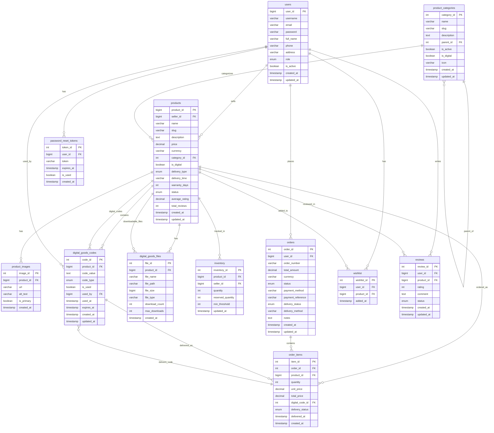

# WEBGMS Database Diagram
## Digital Goods Marketplace Database Schema

## Key Features:

### 🛒 **Digital Goods Marketplace**
- **Multi-vendor support**: Users can be sellers
- **Digital product categories**: Thẻ cào, Tài khoản Game, Phần mềm, etc.
- **Digital delivery**: Instant delivery of codes/files
- **Inventory management**: Track digital stock

### 💳 **Order Management**
- **Order tracking**: From pending to delivered
- **Digital delivery**: Automatic code/file delivery
- **Payment integration**: Multiple payment methods
- **Order history**: Complete transaction records

### 🔐 **Digital Codes System**
- **Code types**: Serial, Account, License, Gift Card, File URL
- **Usage tracking**: Track which codes are used
- **Expiration**: Set expiry dates for codes
- **Security**: Prevent code reuse

### 📁 **File Management**
- **Downloadable files**: Store and serve digital files
- **Download limits**: Control download counts
- **File types**: Support various file formats
- **Size tracking**: Monitor file sizes

### ⭐ **User Experience**
- **Wishlist**: Save favorite products
- **Reviews**: Rate and review products
- **Search**: Find products easily
- **Categories**: Organized product browsing

### 🔒 **Security & Access**
- **Role-based access**: Admin, Seller, User roles
- **Password reset**: Secure token-based reset
- **User management**: Complete user lifecycle
- **Data integrity**: Foreign key constraints

## Database Statistics:
- **Tables**: 12 main tables
- **Relationships**: 20+ foreign key relationships
- **Indexes**: Optimized for performance
- **Digital Focus**: Built for digital goods marketplace
- **Scalable**: Supports multi-vendor operations

