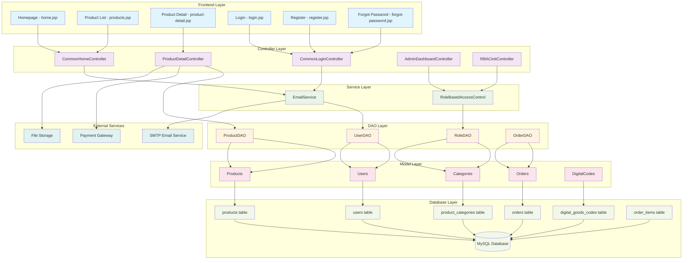

# WEBGMS Project Structure Diagram
## Digital Goods Marketplace Architecture



## Project Structure:

### 📁 **WEBGMS/**
```
WEBGMS/
├── src/java/
│   ├── controller/          # Controllers
│   │   ├── admin/          # Admin controllers
│   │   ├── common/         # Common controllers
│   │   └── user/           # User controllers
│   ├── dao/                # Data Access Objects
│   ├── model/              # Data Models
│   ├── service/            # Business Logic
│   └── filter/             # Security Filters
├── web/
│   ├── views/              # JSP Pages
│   │   ├── admin/          # Admin pages
│   │   ├── common/         # Common pages
│   │   ├── user/           # User pages
│   │   └── component/      # Reusable components
│   ├── assets/             # Static assets
│   └── WEB-INF/
│       ├── lib/            # JAR libraries
│       └── web.xml         # Web configuration
└── missing_tables.sql      # Database schema
```

### 🎨 **Frontend Components:**
- **Electro Bootstrap Template**: Modern UI framework
- **Responsive Design**: Mobile-friendly interface
- **Vietnamese Localization**: Full Vietnamese support
- **Digital Goods Focus**: Optimized for digital products

### 🔧 **Backend Architecture:**
- **MVC Pattern**: Model-View-Controller separation
- **DAO Pattern**: Data Access Object abstraction
- **Service Layer**: Business logic encapsulation
- **Filter Security**: Role-based access control

### 🗄️ **Database Design:**
- **Digital Goods Optimized**: Built for digital products
- **Multi-vendor Support**: Seller management
- **Order Management**: Complete transaction tracking
- **Code Management**: Digital code delivery system

### 🔐 **Security Features:**
- **Role-based Access**: Admin/Seller/User roles
- **Password Security**: Encrypted passwords
- **Token-based Reset**: Secure password recovery
- **Session Management**: User authentication

### 📧 **Email System:**
- **SMTP Integration**: Gmail SMTP service
- **Password Reset**: Token-based recovery
- **Order Notifications**: Transaction emails
- **User Communication**: System notifications

## Key Features:

### 🛒 **Digital Marketplace**
- **Product Categories**: Thẻ cào, Tài khoản, Phần mềm
- **Digital Delivery**: Instant code/file delivery
- **Multi-vendor**: Multiple sellers support
- **Inventory Management**: Stock tracking

### 💳 **Payment & Orders**
- **Order Processing**: Complete order lifecycle
- **Digital Delivery**: Automatic code delivery
- **Payment Integration**: Multiple payment methods
- **Order Tracking**: Status monitoring

### 👥 **User Management**
- **User Registration**: Account creation
- **Authentication**: Secure login system
- **Profile Management**: User information
- **Role Assignment**: Admin/Seller/User roles

### 🏪 **Seller Features**
- **Product Management**: Add/edit products
- **Inventory Control**: Stock management
- **Sales Tracking**: Revenue monitoring
- **Order Fulfillment**: Digital delivery

### 🔧 **Admin Features**
- **User Management**: Approve/disable users
- **Product Approval**: Review new products
- **System Monitoring**: Performance tracking
- **Reports**: Analytics and insights

