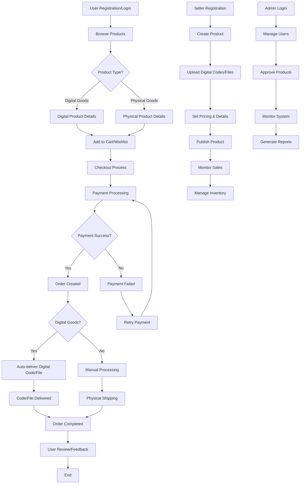

# WEBGMS System Flow Diagram
## Digital Goods Marketplace Workflow

## Key System Components:

### 🏠 **Homepage & Navigation**
- **Product showcase**: Featured digital goods
- **Category browsing**: Digital product categories
- **Search functionality**: Find specific products
- **User authentication**: Login/Register buttons

### 🛍️ **Product Management**
- **Product listing**: Grid view of digital goods
- **Product details**: Detailed information with images
- **Digital specifications**: Code types, delivery methods
- **Inventory tracking**: Stock management

### 🛒 **Shopping Cart & Checkout**
- **Add to cart**: Digital goods selection
- **Wishlist**: Save for later
- **Checkout process**: Secure payment
- **Order confirmation**: Receipt generation

### 💳 **Payment & Delivery**
- **Payment processing**: Multiple methods
- **Digital delivery**: Instant code/file delivery
- **Order tracking**: Status updates
- **Receipt management**: Digital receipts

### 👤 **User Management**
- **Registration**: New user signup
- **Authentication**: Secure login
- **Profile management**: User information
- **Order history**: Past purchases

### 🏪 **Seller Dashboard**
- **Product creation**: Add new digital goods
- **Inventory management**: Stock control
- **Sales tracking**: Revenue monitoring
- **Order fulfillment**: Digital delivery

### 🔧 **Admin Panel**
- **User management**: Approve/disable users
- **Product approval**: Review new products
- **System monitoring**: Performance tracking
- **Reports**: Sales analytics

## Digital Goods Flow:

### 📱 **Thẻ cào (Gift Cards)**
1. User selects card value
2. Payment processed
3. Card code delivered instantly
4. User redeems code

### 🎮 **Tài khoản Game (Game Accounts)**
1. User selects game account
2. Payment processed
3. Account credentials delivered
4. User accesses account

### 💻 **Phần mềm (Software)**
1. User selects software license
2. Payment processed
3. License key delivered
4. User activates software

### 📁 **Files & Downloads**
1. User selects digital file
2. Payment processed
3. Download link provided
4. User downloads file

## Security Features:
- **Encrypted passwords**: Secure user data
- **Token-based reset**: Safe password recovery
- **Role-based access**: Admin/Seller/User permissions
- **Order validation**: Prevent fraud
- **Code protection**: Secure digital delivery

